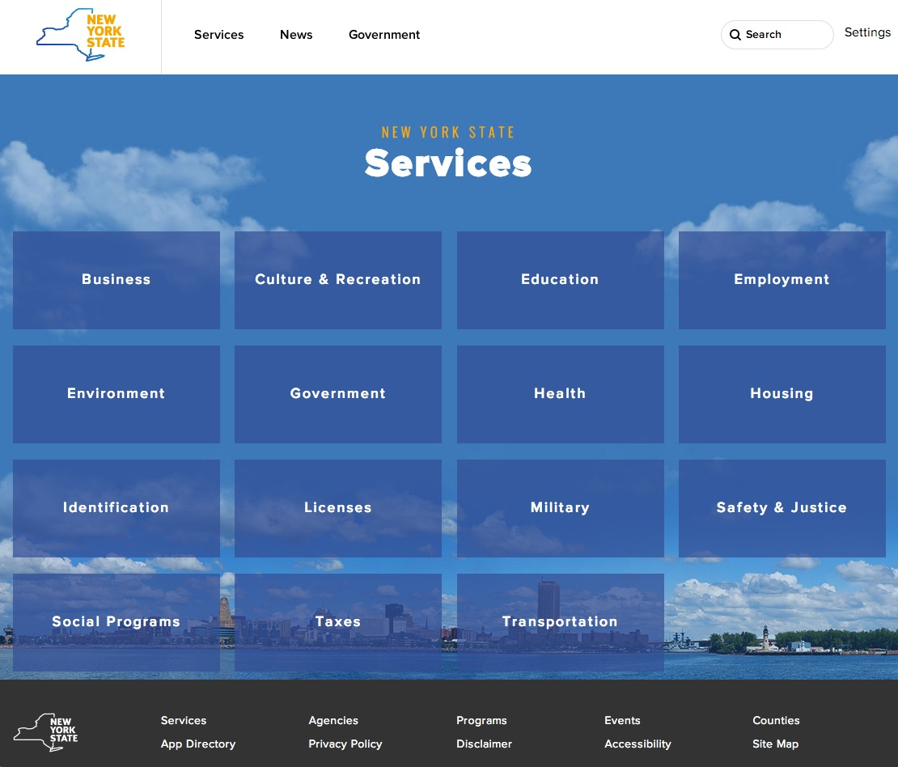

###Footer code and guidance

  - Use a development site or run a local version for the beta period. __This is not the final version.__
  - Add the footer at the bottom of your test pages
  - Test for desktop and mobile [Tool for testing multiple devices](http://responsive.victorcoulon.fr/)
  - Test for any specific needs of your site(s)
  - Take screenshots and reference in feedback
  - Thank you for participating!

#### Code Snippet

```
    <div id="nygov-universal-footer">
    <noscript>
        <iframe width="100%" height="86px" src="//nygovstg.prod.acquia-sites.com/load_global_footer/ajax?iframe=true" frameborder="0" style="border:none; overflow:hidden; width:100%; height:86px;" scrolling="no">
        </iframe>
    </noscript>
</div>
```

##### See the header demos for a simple example

- [Interactive Header Demo](http://nys-its.github.io/universal-navigation/demos/interactive-option-demo.html)
- [Static Header Demo](http://nys-its.github.io/universal-navigation/demos/static-option-demo.html)


#### Screenshots for reference:

##### Universal Navigation - Footer only (Desktop)


##### Universal Navigation - Footer only (Mobile)


##### Universal Navigation in context of ny.gov (desktop view):


